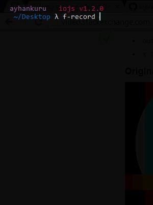

## F-record

```sh
$ npm install -g f-record
```


## Usage 

```sh
$ f-record --record [$videoname] [$time]
```


```sh
$ f-record --record test 15
```

## Example



#### Requires
  * [ffmpeg](http://ffmpeg.org/) 
  * [Screen Capturer Recorder](http://sourceforge.net/projects/screencapturer/files/) 
  

**[windows path should be to added ](http://www.computerhope.com/issues/ch000549.htm)**
